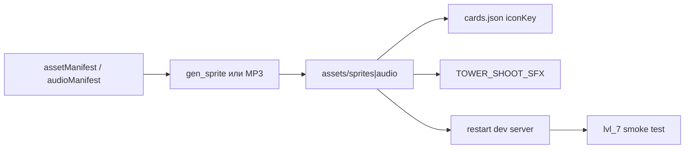

# Fusion hybrid assets — playbook (спрайты и звуки)

> **Статус: спрайты готовы, звук остаётся.** Манифесты и роутинг заведены; **6 PNG
> сгенерированы** и фоллбеки на родителей сняты из `ASSET_FALLBACKS`. Остаются **6 MP3
> вылета** (генерируются вручную — тулзы под звук в репо нет) + стретчи. После звука —
> перенести в `docs/done/` и обновить [current-state.md](../working/current-state.md).

Источники: GDD §6.5 ([synergy-grid-td-v2.md](../backlog/synergy-grid-td-v2.md)),
боевые перки — `hybridPerks` в `cards.json`, сим — [BattleSim.ts](../../src/game/BattleSim.ts).
Сводный статус доработки: [hybrid-towers.md](hybrid-towers.md).

## Пайплайн (общий)

1. Запись в [assetManifest.ts](../../src/config/assetManifest.ts) + [tools/assets.manifest.json](../../tools/assets.manifest.json) (спрайты) и [audioManifest.ts](../../src/config/audioManifest.ts) (звуки).
2. Генерация файлов на диск.
3. `iconKey` гибрида = имя ключа (уже в `cards.json`).
4. `TOWER_SHOOT_SFX` в [BattleScene.ts](../../src/scenes/BattleScene.ts) — по `cardId`.
5. Перезапуск `npm run dev` (glob ассетов на старте).
6. Smoke: lvl_7, фьюжн → постановка → вылет/попадание слышны, спрайт не родительский.

**MVP:** иконка+tower (512) для всех 6; `_dirs` и уникальные `sfx_hit_*` — второй проход.
До PNG действуют [ASSET_FALLBACKS](../../src/config/assetManifest.ts) на родительские башни.

---

## Спрайты

Инструмент: [tools/gen_sprite.py](../../tools/gen_sprite.py) — промпт **EN**, `--ref` на родителя.

| Гибрид | Ключ | Ref | Команда (tower 512) | `_dirs` |
|--------|------|-----|---------------------|---------|
| Паровая Пушка | `steam_cannon` | `frost_pulse` | `python tools/gen_sprite.py "steam cannon hybrid turret, frost and fire fusion, chunky armored turntable with hissing steam vents and orange-ice dual glow core" assets/sprites/steam_cannon.png --category tower --size 512 --ref assets/sprites/frost_pulse.png` | нет (статична) |
| Криоразряд | `cryo_discharge` | `storm_coil` | `... cryo discharge hybrid turret, tesla fused with frost crystals ... --ref assets/sprites/storm_coil.png` | нет |
| Ионный Залп | `ion_volley` | `plasma_shutter` | `... ion volley rapid plasma with electric rings ... --ref assets/sprites/plasma_shutter.png` | стретч: `ion_volley_dirs` + `COMPOSED_AIM_SHEETS` |
| Термокопьё | `thermo_spear` | `railgun` | `... thermo spear heated rail glowing molten orange ... --ref assets/sprites/railgun.png` | стретч |
| Ледобой | `icebreaker` | `railgun` | `... icebreaker frosted rail with cyan ice coating ... --ref assets/sprites/railgun.png` | стретч |
| Гаусс-Катушка | `gauss_coil` | `railgun` | `... gauss coil magnetic rail with violet coils ... --ref assets/sprites/railgun.png` | стретч |

- [x] `steam_cannon.png`
- [x] `cryo_discharge.png`
- [x] `ion_volley.png`
- [x] `thermo_spear.png`
- [x] `icebreaker.png`
- [x] `gauss_coil.png`

Все 6 сгенерированы `gen_sprite.py --category tower --size 512 --ref <родитель>` и подключены
(фоллбеки сняты). Карточная иконка в руке использует тот же ключ (`iconKey`); при
необходимости отдельный рендер `--category card_icon --size 256`.

---

## Звуки

Контракт: [assets/audio/README.md](../../assets/audio/README.md), ключ = `assets/audio/<key>.mp3`.
Роутинг вылета: `TOWER_SHOOT_SFX[cardId]` в BattleScene. Попадание — по стихии (`ELEMENT_HIT_SFX`);
опционально `sfx_hit_steam` / `sfx_hit_thermo` для уникального фидбэка (стретч).

| Гибрид | Вылет | Попадание | volume shoot |
|--------|-------|-----------|--------------|
| `steam_cannon` | `sfx_shoot_steam` | `sfx_hit_steam` (стретч) | 0.5 |
| `cryo_discharge` | `sfx_shoot_cryo` | Electricity / `sfx_hit_storm` | 0.45 |
| `ion_volley` | `sfx_shoot_ion` | Fire / `sfx_hit_plasma` | 0.5 |
| `thermo_spear` | `sfx_shoot_thermo` | `sfx_hit_thermo` (стретч) | 0.6 |
| `icebreaker` | `sfx_shoot_icebreaker` | Water / Physical | 0.55 |
| `gauss_coil` | `sfx_shoot_gauss` | Electricity | 0.55 |

Промпты — в [audioManifest.ts](../../src/config/audioManifest.ts) (блок «Fusion hybrid towers»).

- [ ] `sfx_shoot_steam.mp3`
- [ ] `sfx_hit_steam.mp3` (стретч)
- [ ] `sfx_shoot_cryo.mp3`
- [ ] `sfx_shoot_ion.mp3`
- [ ] `sfx_shoot_thermo.mp3`
- [ ] `sfx_hit_thermo.mp3` (стретч)
- [ ] `sfx_shoot_icebreaker.mp3`
- [ ] `sfx_shoot_gauss.mp3`

---

## Проверка в игре

- [ ] Admin → lvl_7, фьюжн двух карт в руке
- [ ] Гибрид в руке — свой спрайт (не плейсхолдер родителя, если PNG есть)
- [ ] Постановка на слот — `sfx_place`, турель на поле
- [ ] Выстрел — уникальный `sfx_shoot_*`, не общий `sfx_shoot`
- [ ] Эффект в бою соответствует перку (пар/AoE, Wet на chain, shrapnel на pierce, …)

Headless: `npx tsx tools/verify_hybrids.ts`

---

## См. также

- [tower-sound-design.md](../done/tower-sound-design.md) §1.5
- [tower-readability.md](../done/tower-readability.md)
- [tools/README.md](../../tools/README.md)
